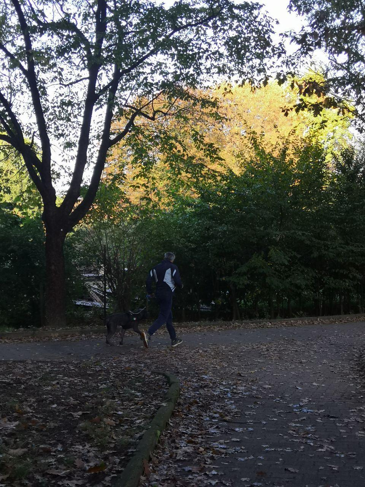
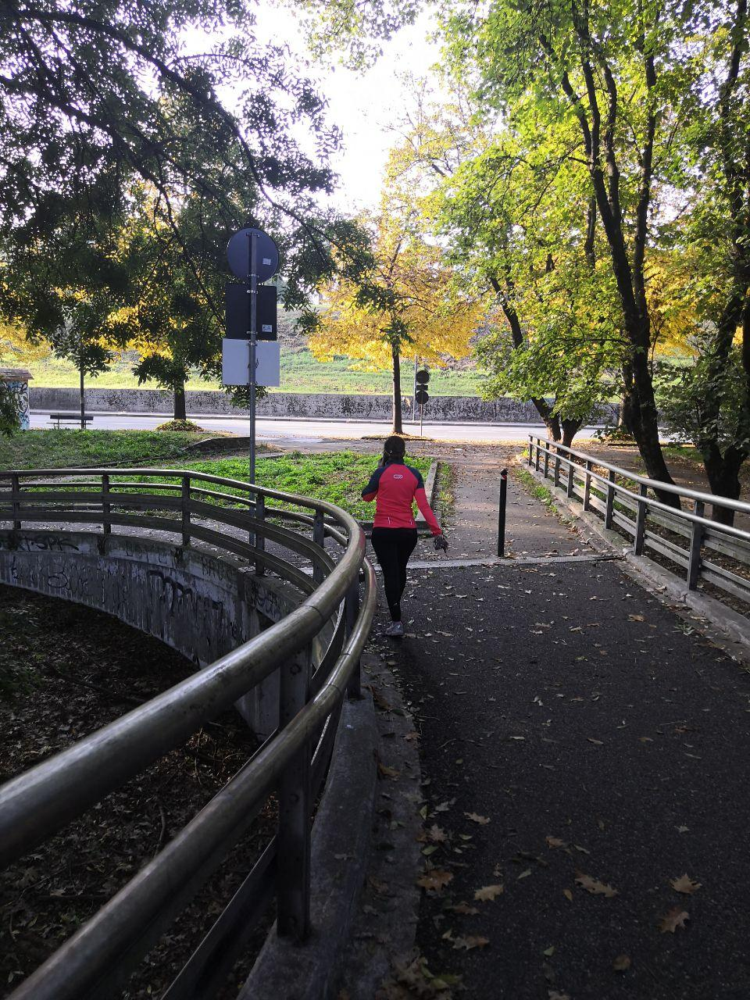
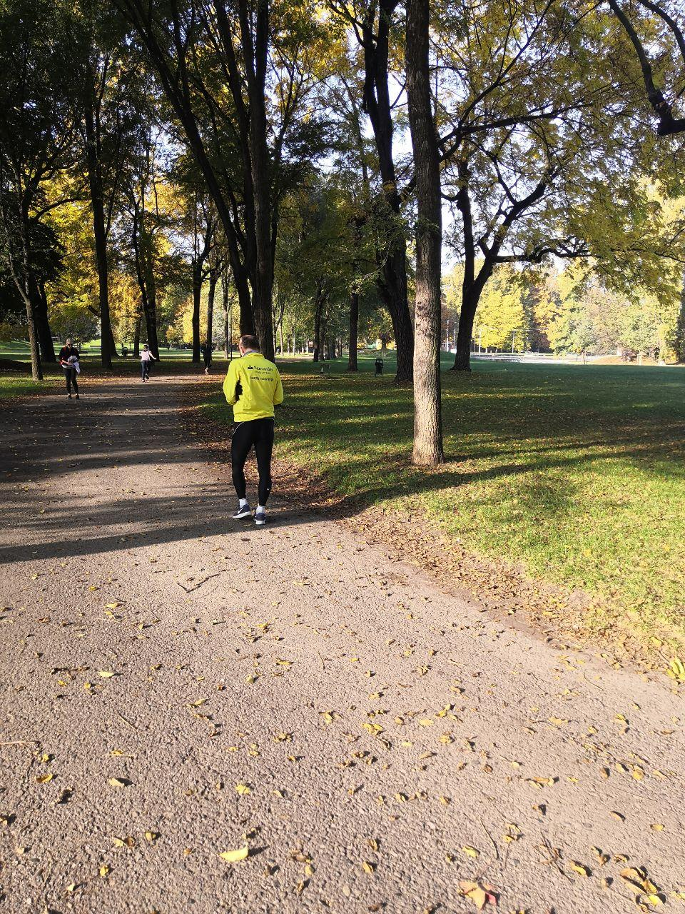
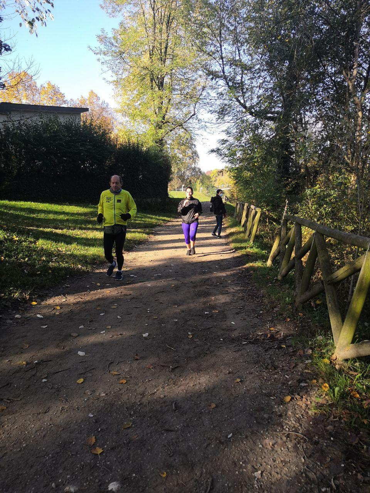

# Milestone 1: Project description and Needfinding: RunTogether

## Overview and planning

- What: activities including jogging and running
- Who: a group of (3-4) amateur runners (alone or part of group) and trainers
- Where: at the park
- When: before running (10 Minutes), during the activity by joining to the group (10 Minutes)
- How: join the group as a runner, see what they do

## Observation

 
  
   
<em>The group of a running club who has the same plan for running are doing warm-up exercises before running.</em>

  
 
  
   
  <em>Two friends have the same speed and they match well together for running, they are motivated because they are at the same level.</em>

  
   
    <em>A member of the running group reached late and he did not know the current location of the group in the park, so he started doing warming exercises lonely and lost the group.</em>

  

  

 

  During the observation, at the park, we faced an almost 60-year old senior citizen who was jogging lonely with a cane. Later, we realized that he fell behind other runners because of the lack of coordination in his age and the capability in the group. It was crystal clear that he was interested in participating in this activity with others because he attempted to run as fast as possible to reach the group, although it seemed unfeasible. Ultimately, he sat on the bench beside the running track, watching the runners. The shortage of finding the proper groups, in this case, matching with their preferences, made the group running a little bit problematic.
 

 

  

  

  Running with the dog; the activity doing by this middle-aged man; could be a substitution for joining the group. He, like a professional runner, was about 48 years old, seemed to do this activity almost every day because he had a personal running plan. He enjoyed running alone since he did some activities, like playing with his dog, changing the running path, and altering the running pace from time to time, which would be difficult doing them in the group. Sometimes, he ran slow for setting his favorite music on his cellphone, which is one of the essential motivating sources for running; after that, he started running fast. All in all, he was full of the motivation of running because of having these freedoms of choice.

    <!-- 
For this solo person running alone with the dog, including listening to her favorite music during this activity, is the vital source of motivation.
 -->

  
   
    <em>Lisa is an amateur runner, every time before running she calls her friends to join her but this time she could not find them in the park.</em>

 

  
   
    <em>Roberto is a retired man, he some times runs in the park. in this picture, he was tired of running and he looked unmotivated. </em>

 

 

  
   
    <em>Suddenly a woman wanted to pass near Roberto, he felt like he was in a competition and he started to run faster.</em> 

### Interviews

- How is your typical running activity?
  - answers : One of the runners do this activity by listening to music in the morning, two of them usually go running between 30 minutes and 1 hour two times in the week, one of them prefer jogging instead of running.
- What is the motivation behind taking on this activity?
  - answers : All the runners have the same motivations for running, keep healthy, and stay fit. One of them mentioned that, after running, his feelings change drastically, and running is the essential way to disconnect from routine daily life.
- Which is your first priority for running : with a group or alone ? Why?
  - answers : Runners had different points of view for this question, three of them enjoy running with others because in this way they stay motivated and not getting bored, two of them, on the other hand, would like to run alone. They confessed that they can manage their time better, in addition, they can not find a suitable group running.
  - (Ask in case of Group) Do you prefer running with some one who is professional or not?
    - answers : One of them expressed his interest in doing this activity with the person who is at a better level, however, for others, this aspect does not matter.
- Can you tell me some good and bad stories concerning running in a group/alone?
  - answers : One runner told the bad stories about the bad weather condition, leading to a negative effect on his day of running, said that it was a good idea to know the condition of it in advance. Another one mentioned a good story about running with his boyfriend, which helped her to stay motivated instead of running alone. The last runner, on the other hand, shared a bad story once running in a group, complained about the pace of running in this situation, not satisfying his interests.
- What do you appreciate about running in Group / alone and what not?
- How would you describe your experience in terms of running in a Group / alone?
  - (Ask in case of Group) How do you interact with other runners to organise a running plan, share tips and etc?
  - How do you feel about your current state of running (Group / alone)?
- Have you ever felt unmotivated for running? If yes what would you do?
- Do you get motivated after running with someone to continue running? why ?
- What do you think about joining to run club and partcipation in competitions?
- How do you feel when you reach the goals you desired to be done during your sport activity?
- For you, running is like...?
- I keep motivated for running by...

## User Needs

<!-- [Write down the results: list here the 5-6 user needs you identified.] -->

According to the observations, the following needs are concluded:

1. The majority of runners prefer running or jogging activity with the other runners, especially those having the same preferences. Like John, the senior citizen; expresess his interest in running with others, but he has to do it alone. Therefore, their specific requirements would be joining the group based on their qualifications.
2. A few runners like Davron; have been kept motivated by listening to their favorite musics and also trying to stay motivated by getting the new running path for future activity.
3. Some specific requirements would be probable met by providing the weather condition in advance or the possibility of sharing each others' tips and stuff.
4. Some runners had the problem of preparing the best outfit for sport, As an example Omid said he wants suggestions for the appropriate product.
5. Most of the interviewees emphasized the possibility of having a training plan or schedule; lead to keeping motivated; like Roberto a retired man; take part in a competition with another person with the same level is the main goal using a proper running plan.

<!-- join together [TODO] -->

<!-- - most of the interviewee insisted on the need to have a plan or schedule for running which could keep them forward and motivated for the next run.
- Roberto was the retired man in the pictures, for being motivated he said it is a good idea for him to take part in a competition with another person with the same level. -->

<!-- 1- The runners need a group to join for following same plan, since some people become unmotivated if they run lonely, the group helps them to feel motivated (based on the picture1) -->

<!-- 2- Davide and Marco are friends together and usually they run together after the work and at the weekends, they are in the same level(pace,duration), it is needed to find someone who is in the same age, level and your week schedule. (based on the picture2) -->

<!-- 3- Needs to be able to find the current location of the running track for the runner who is is detached from the group because of arriving late.

4- Lisa was the woman who was looking for her friend to join her , it is needed for her to use a platform which let her find the location of the running group. -->

## Project Description

<!-- [A short paragraph (2-4 sentences) that describes how your project would address one (or two) deep user needs, by including your personal take on suitable strategies to adopt. Mention here the target device(s) (e.g., smartphone, tablet, smart watch, etc.).] -->

Two essential needs would be considered addressing in this project:

- joining the running group
- offering training plan

Group running is one of the most vital requirements, leading to continuous self-motivation among runners, which will deal with by asking some basic questions from runners at the first to understand their specifications, coming with a suitable running club or group to join. Besides, running in a group requires training plans, addressing by the possibility of process observation during the time, followed by offering a proper schedule of running to the participants based on their objectives achieved by questions asked. These requirements would be satisfied with the help of the smartphone as the frequent devices among most runners.
