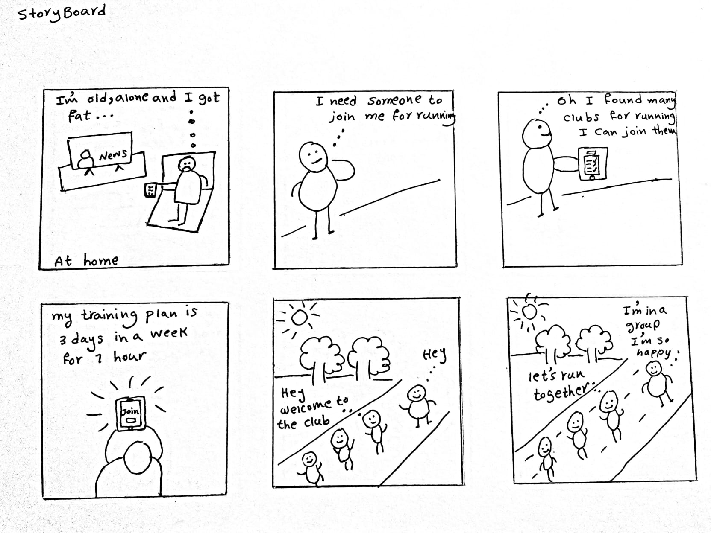
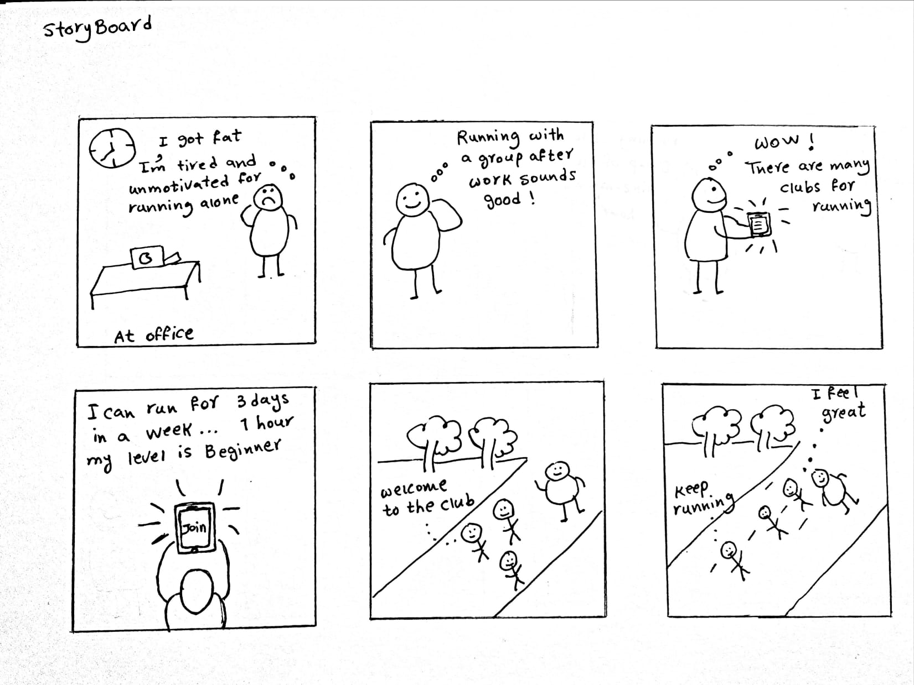
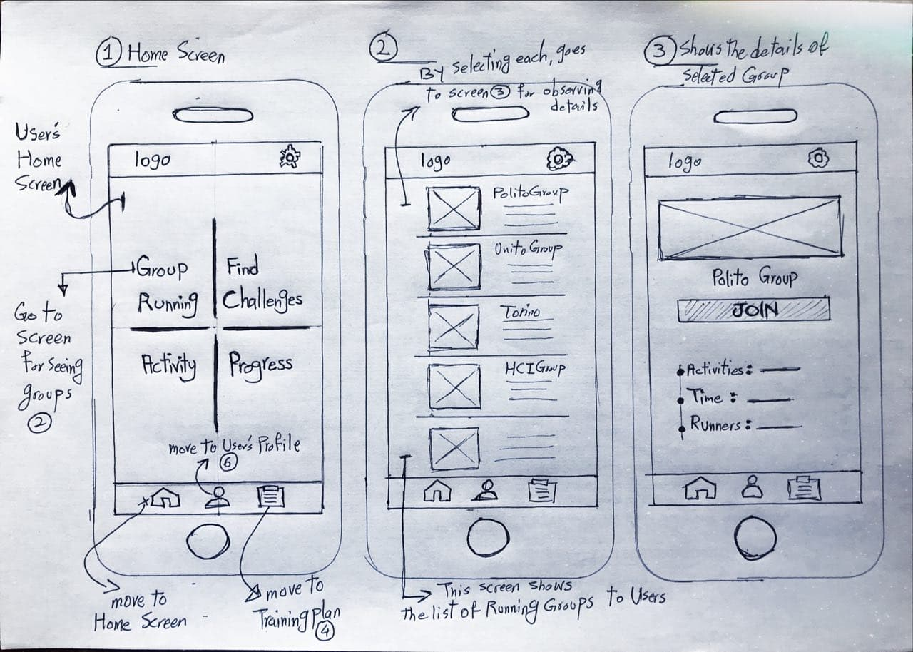
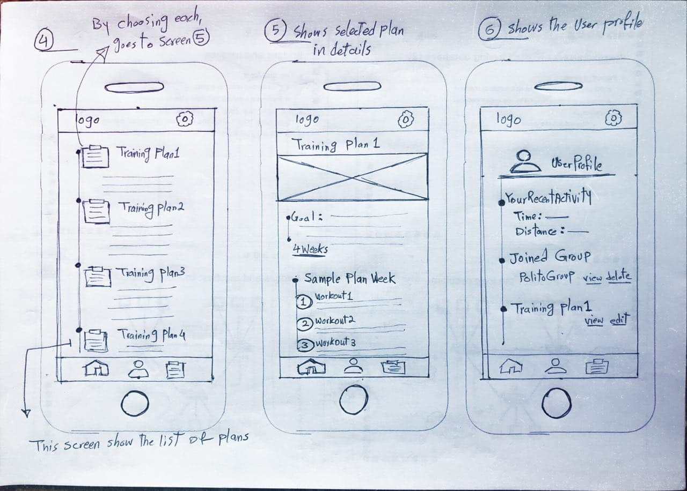
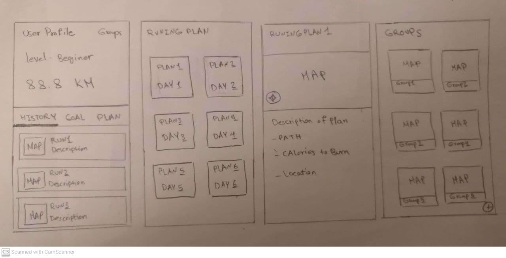
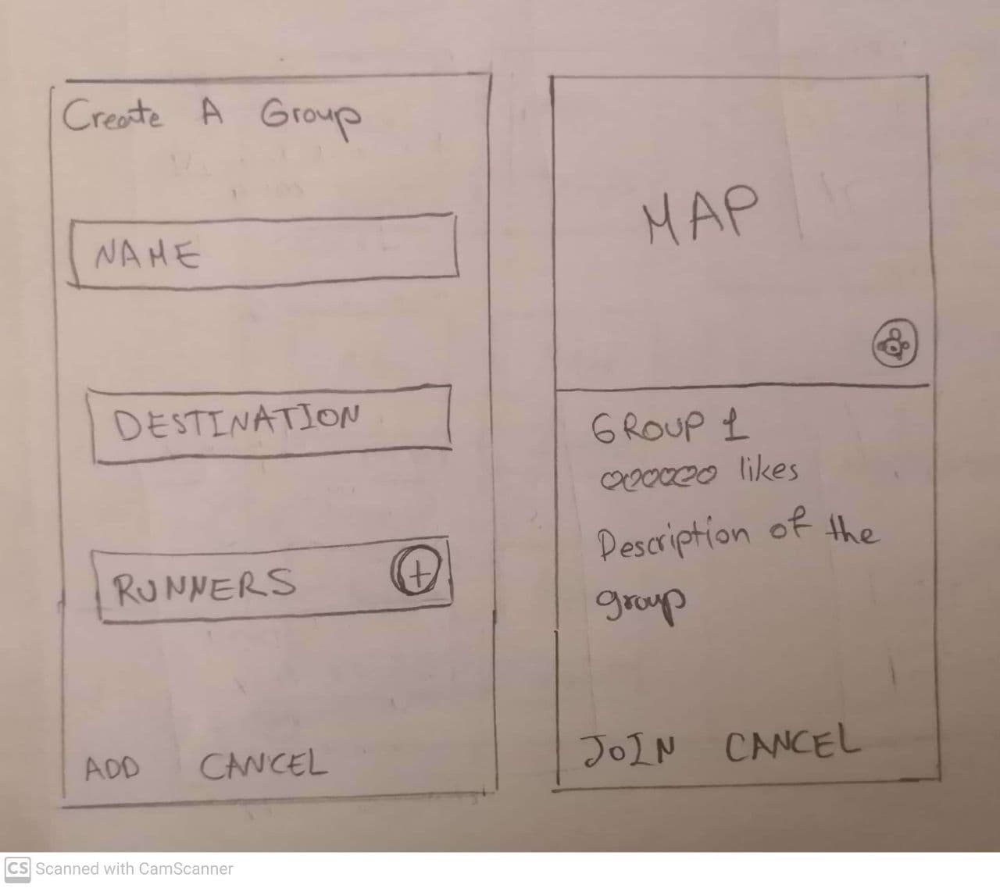

# Milestone 2: Low-Fi Prototyping - RunTogether

<!-- _ISTRUCTIONS_: Fill this template by writing under each title, according to the instructions reported in `[]`. When you have done, remove this line, and put the file in your private group repository on GitHub, under a `M2` folder. -->

## Storyboards

<!-- [Illustrate here the storyboard you created, and describe: a) why you chose it, b) which are its strengths and weaknesses, and c) how well it achieves the identified goal/user need. Include a comprehensive set of digital photos or scans of your storyboard.] -->

We chose these stories based on our observations and interviews.

### Storyboard 1

<b>a) why you chose it : </b>
We came to the this story because: In our observation we saw that old or middle-aged people are really need to run with a group that has similar preference,age and goal.

<b>b) which are its strengths and weaknesses : </b> 
<b>strengths :</b>  

- It shows very well one of our target user who is old,aunmotivated and alone for running and need a group/club for running.  
- It shows very well that the person has not a specific training plan and he wastes his time by watching TV.  
- It shows very well that the person feels satisfied after joining and running with a group.  

<b>weaknesses :</b>   
- It is not obvious from drawings that user is old or young and should read the its caption.  
<b>c) how well it achieves the identified goal/user need :</b> It shows very well the user need a group/club for running and he does not have any training plan,and the application ask him his preferences for a week for giving him a specific plan for running. At the end of the story it shows he feels satisified and happy.

 

  

### Storyboard 2
<b>a) why you chose it : </b>
We came to the this story because: In our interviews we realized that people do not dedicate a certain time for running or doing exercies in their daily routine, although they know it is very helpful for their physical and mental health, they are busy with their works. 

<b>b) which are its strengths and weaknesses : </b> 
 
<b>strengths : </b> 

- It shows very well one of our target user who is young,busy and unmotivated for running and at the same he wants to keep fit. 
- It shows very well that after working hour, running with a group can be enjoybale and also be a motivation for keep going.  
- It shows very well that the running group has a leader.  

<b>weaknesses :</b> 
- These two stories seem to similar to each others.
 

<b>c) how well it achieves the identified goal/user need :</b> It shows very well the user is busy and need a training plan for following after his work, also it shows if he had someone for running even after work he will go for running.  

## Paper Prototypes

<!-- [Report here the two realized paper prototypes, by including a comprehensive set of digital photos or scans of them (captions included) and by summarizing how they connect to the storyboard and the project description, and how they explore different alternative ways of satisfying the project goal. Be sure to include the high-level flow of each "screen" of both paper prototypes.] -->

### Paper Prototype 1

As it has drawn on the storyboards and also from the project description point of view, the main objective of this prototype is to meet runners' needs through finding a suitable group based on their expectations and requirements. The mentioned needs of users in the description of the project are satisfied by offering a different kind of groups showing on screen 2; with a variety of training plans which are required for the runners to stay motivated on screen 4. Besides, users are interested in review their progress and activities during participating in as illustrated on the user profile on screen 6.

  

### Paper Prototype 2

In this prototype, we are focusing on the main goals in the project description; As what we mentioned there, the main goals are searching and joining groups, having running plan and checking the user's activities.

  
The order of connecting the pages are:

1. The first page is the "User Profile" page, in this page user can visit a history of the runs, plans and goals with the ability to check his progress. by selecting the "Groups" button, user can watch the list of groups page.(last page)
2. By selecting the "PLAN" in the profile page, user will see the content of the "RUNNING PLAN" page. the content will be fetched dynamically inside the buttom part of the "User Profile" page.
3. By selecting each squares inside the "RUNNING PLAN" content , the next content with the name of the plan will be shown totally in a new page.( example " RUNNING PLAN1")
4. After selecting the "Groups" button, a new page with all the groups will be shown. ( the last page )
    
     
5. When user clicks the plus button in the buttom of the "Groups" page, page "Create A group" will appear. By pressing "ADD" or "CANCEL" button , it will return to the "Groups" page. 
6. After selecting each squares inside the "Groups" page, the last page of the above picture will appear, it will be filled by the details of the selected group. By selecting "JOIN" button, user will be added to the group and he will return to the "Groups" page. After selecting the "CANCEL" the user will be navigated to the "Groups" page. 
   --The "MAP" content shows a picture of the location of the Run

## Selection Rationale

<!--
[Describe here which of the two prototypes you choose for continuing your exploration. Write a list of pros and cons for each prototype, and give the reasoning for your choice. You can consider moving some features from a prototype to the selected one, if it makes sense: in this case, explain why and list the changes that your team plan to perform.] -->

In terms of prototype 1; form the users' perspective, it had strengths as follow:

- access easily and quickly to different parts of the application's functionalities without make the users think
- existing the specific screen showing the details of Group Running
- An ideal arrangement of page items and creative implementation of elements in the page related to the design of screens.

On the other hand, the weaknesses mentioned in this way:

- the users' home screen is obscure; having some extra functionalities that make the user confused to perform their operations
- the lack of feature for creating the new group by the users; as a motivating mechanism

By looking at the second prototype, listing pros and cons in this way:

- representing the level and total running kilometers for each user can keep him motivated.
- the user's profile designed in a suitable way which focuses on the main project goals.
- having the opportunity to create a group for users can make users more motivated.
- showing the popularity of the group can be a nice point to differentiate groups better.

And the cons:

- some of the features like the "GOAL" tab in the profile page is not clear.
- the running plan does not make users eager to follow the plan. the design is not so motivational.
- it is not a good idea to place the Groups button which is one of the main functionalites of the project, inside the user's profile. designing a menu and place it in the mentioned part is a better solution.

Conclusion:
After scrutinizing both prototypes, the final choice would be a mixture of the mentioned prototypes. The first one shows functionalities in an organized way and detail; on the other hand, the second one provides a better entering point to the App by choosing a more understandable way. Besides, the shortage of a creating group running by the user could be addressable by the second prototype. Last but not least, the second one could not satisfy the users' requirements in terms of offering consecutive plans of training; however, covering in another prototype. To sum up, the entering point of the application and the functionality of creating and choosing groups, will be chosen from the second prototype. the functionality for scheduling plans and keeping users motivated by following the mentioned plan will be chosen from the first prototype.
