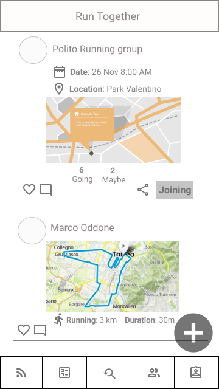
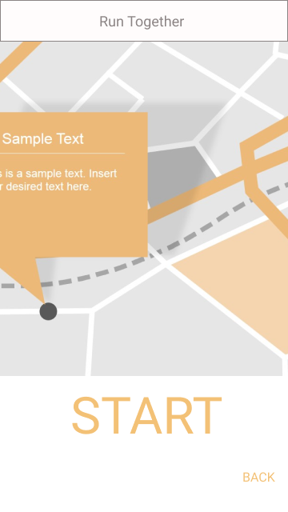
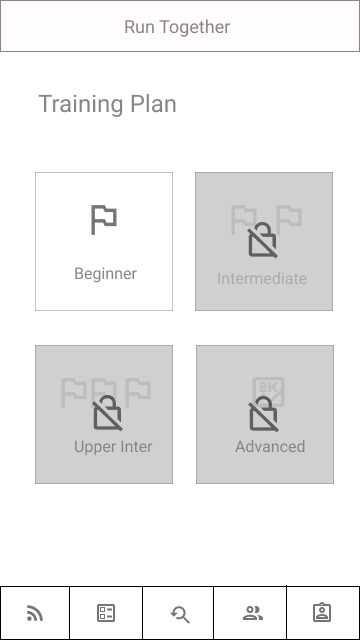
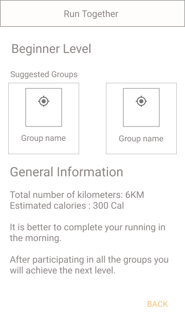
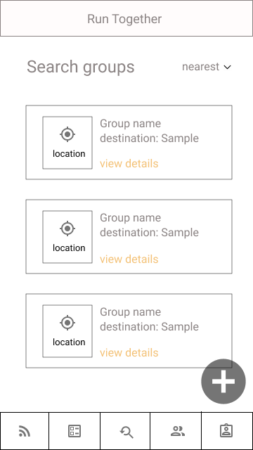
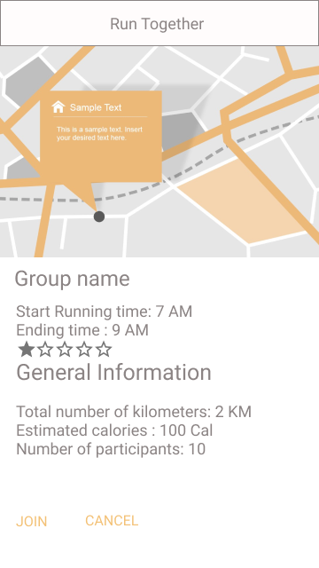
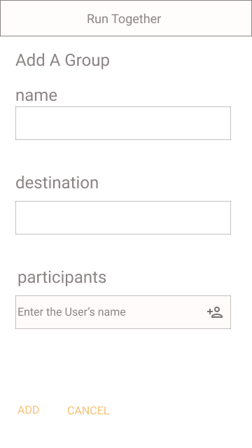
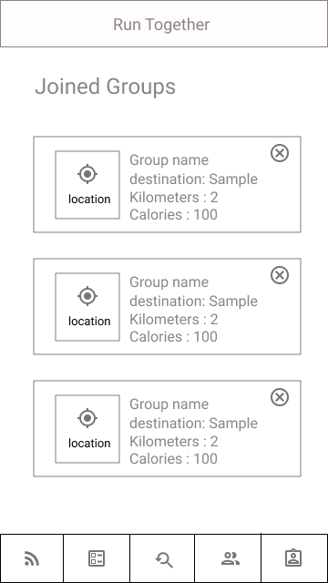
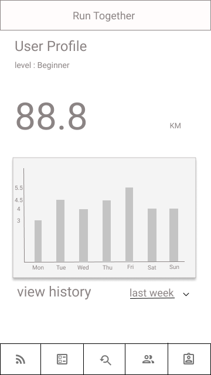

# Milestone 3: Wireframe and Heuristic Evaluation - [RunTogether]

_ISTRUCTIONS_: Fill this template by writing under each title, according to the instructions reported in `[]`. When you have done, remove this line, and put the file in your private group repository on GitHub, under a `M3` folder.

## Wireframe
[Add here the link to the PDF documents, or embed the images, that represent your wireframe. Briefly explain which tool you used to create the wireframe, any relevant decision you took starting from the outcome of M2, and describe in short the navigation among pages (with a picture or in text).]
Tools: the final wireframe is drawn in Figma
After designing the pen and paper prototype in M2, we decided to complete the missing description and choose a better title for the pages in prototype 2, so we add 2 pages containing the actions for start running and discovering last activities in the joined groups. Moreover, the page for Training plan was changed into another design to motivate users more. In the last Molestone, the design for the profile page contained some tabs in the middle of the page and it became an issue, hence we decided to move the tabs to the bottom of the page in a specific menu.
Feed page
This page is the starting page of the application. In this page user can discover the last notifications or plans for running from the nearby groups or the groups which he joined.

 
Start workout page
After pressing the plus button in the Feed page, the application will monitor the user's running.

 
Training plan page
According to the level of the user, the appropriate level of plan will be unlocked and in the next page user can discover the groups which fits his needs and level.

 
Plan details

 
Group Search page
In this page, user can find the groups according to the filters which he applies ( location, number of participants , maximum KM , maximum time )

 
After pressing view details, the next page will be shown

 
By selecting the plus button in Group Search page, User can create a group and add the participants by inserting their user names.

 
Joined Groups
In this page, user can visit or remove the groups that he is joined in.

 
Profile Page
The history of running is shown to the user according to the filters he selects ( last week, last month , year)

 
The bottom menu from left to right navigates to Feed page, Training plan page, Group Search page, Joined Groups page and Profile page.

## Heuristic Evaluation
[Describe here the heuristic evaluation you received. In particular, report your preparation of the heuristic evaluation: which material you used (with links and/or pictures). Then, briefly summarize how the heuristic evaluation was conducted by the facilitator, by including 1-2 photos/screenshots from those taken by the facilitator for each evaluation. Include the evaluation result from the evaluators (please mention which group helped you), for example as a link to the on-line spreadsheet.
Finally, write a non-trivial list of potential changes that your team plans to implement and justify each change by explaining which piece of feedback generates it.]
