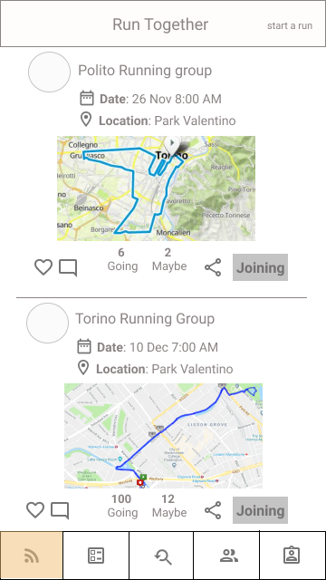
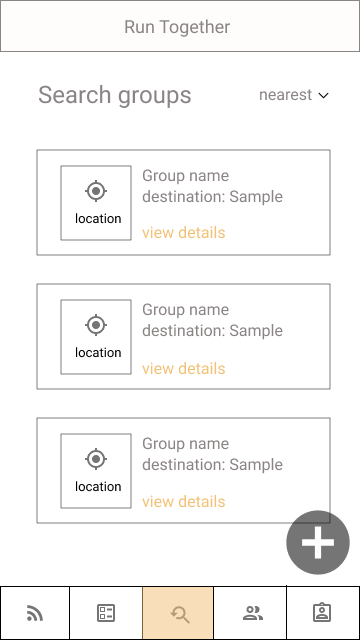

# Milestone 3: Wireframe and Heuristic Evaluation - [RunTogether]

<!-- _ISTRUCTIONS_: Fill this template by writing under each title, according to the instructions reported in `[]`. When you have done, remove this line, and put the file in your private group repository on GitHub, under a `M3` folder. -->

## Wireframe
<!-- [Add here the link to the PDF documents, or embed the images, that represent your wireframe. Briefly explain which tool you used to create the wireframe, any relevant decision you took starting from the outcome of M2, and describe in short the navigation among pages (with a picture or in text).] -->

Tools: the final wireframe is drawn in Figma
 
After designing the pen and paper prototype in M2, we decided to complete the missing description and choose a better title for the pages in prototype 2, so we add 2 pages containing the actions for start running and discovering last activities in the joined groups. Moreover, the page for Training plan was changed into another design to motivate users more. In the last Molestone, the design for the profile page contained some tabs in the middle of the page and it became an issue, hence we decided to move the tabs to the bottom of the page in a specific menu. 

<b>Feed page</b> 
This page is the starting page of the application. In this page user can discover the last notifications or plans for running from the nearby groups or the groups which he joined. 

 
<b>Start workout page</b> 
After pressing the plus button in the Feed page, the application will monitor the user's running.   

 

<b>Training plan page</b> 
According to the level of the user, the appropriate level of plan will be unlocked and in the next page user can discover the groups which fits his needs and level.  

 

<b>Plan details</b> 
After pressing the train plan, following image will be shown
 

 

<b>Group Search page</b> 
In this page, user can find the groups according to the filters which he applies ( location, number of participants , maximum KM , maximum time )

 

 
<b>Group detail page</b> 
After pressing view details in group search page, the next page will be shown 

 

 
<b>Add Group page</b> 
By selecting the plus button in Group Search page, User can create a group and add the participants by inserting their user names. 

 

 

<b>Joined Groups</b> 
In this page, user can visit or remove the groups that he is joined in.

 

 

<b>Profile Page</b> 
The history of running is shown to the user according to the filters he selects ( last week, last month , year)

 

 
The bottom menu from left to right navigates to Feed page, Training plan page, Group Search page, Joined Groups page and Profile page.

## Heuristic Evaluation
<!--[Describe here the heuristic evaluation you received. In particular, report your preparation of the heuristic evaluation: which material you used (with links and/or pictures). Then, briefly summarize how the heuristic evaluation was conducted by the facilitator, by including 1-2 photos/screenshots from those taken by the facilitator for each evaluation. Include the evaluation result from the evaluators (please mention which group helped you), for example as a link to the on-line spreadsheet.
Finally, write a non-trivial list of potential changes that your team plans to implement and justify each change by explaining which piece of feedback generates it.]-->

The evaluation is done with <b>Sportify</b> team through this shared excel document:  
https://docs.google.com/spreadsheets/d/1OdyJ5gXErBWyZoP9PEIsTN6Kymwd0BWhgXqkmuWeM-c/edit#gid=0

The facilitator shared the link of wireframe to the evaluators:  
https://www.figma.com/file/6H5F2Tti7uppQfdXxuSG5t/profile-page?node-id=109%3A240

First facilitator explained the description and main activites of the project, then ask them to do the some tasks to see how they can be involve with the wireframe, forexample: find a running group, join to a group, check their progress in running, search a group and so on, and in the middle of doing these tasks they encountered with some doubts, or issues and they reported to the facilitator. 

<b>Feedbacks with our potential changes:</b>  

[<b>Feedback evaluator1:</b> You cannot go back after you have joined a run group] 
<b>Our response:</b> After joining to a group, it returns to the joined groups and if you cancel you will back to the groups.

[<b>Feedback evaluator1:</b> Search bar does not appear in the search menu] 
[<b>Feedback evaluator2:</b> The page for searching teams doesn't have a search bar for finding teams by name] 
<b>Potential change1:</b> Putting this function for filtering the groups based on the location, number of members, max km for runnign and group rate and also by typing name of the group.

[<b>Feedback evaluator1:</b> Menu at the bottom of the application lacks description; it is not simple to understand functionality of the icon] 
<b>Potential change2:</b> We will add a short text for each icons such as: Feed,Training,Groups,Profile to convey its  functionality easier and without hesitation.

[<b>Feedback evaluator2:</b> Buttons "Join" and "Cancel" in the page for joining a team and also the "Add" button when registering a team all share the same color, making it confusing] 
<b>Potential change3:</b> The proper set of colors will be apply for buttons and texts. 

[<b>Feedback evaluator2:</b> When adding a new team having the button named as "Add" instead of "Save" isn't conform to standards.] 
<b>Our response:</b> We think for adding a new group the proper word is "Add" since we don't want to save changes.   

[<b>Feedback evaluator2:</b> Having the "+" button for adding a new team in the page for searching teams may not be intuitive at first.] 
<b>Our response:</b> For adding a new group the only page that seems related and easier is searching group. 

[<b>Feedback evaluator2:</b> The procedure for adding members isn't easy to understand: requiring the user to insert manually all names in a single text field can lead to errors.] 
<b>Potential change4:</b> Putting placeholder name for textboxes to help user to write the username and at the same time searching that username. 

