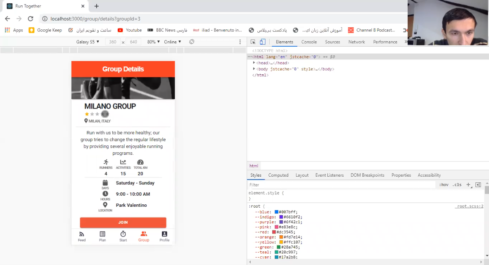
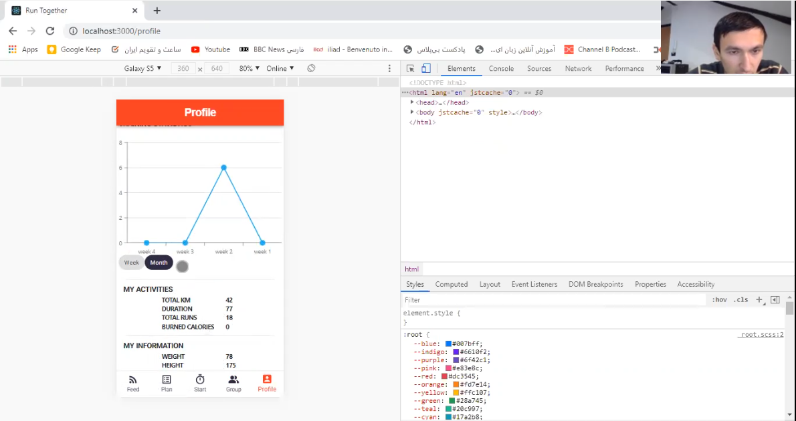
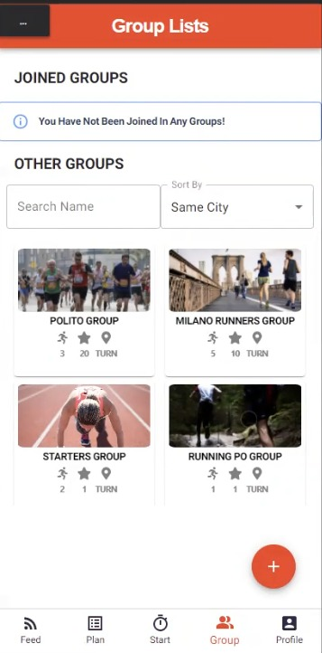
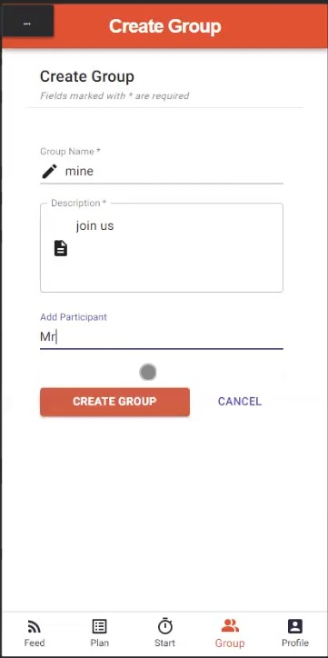
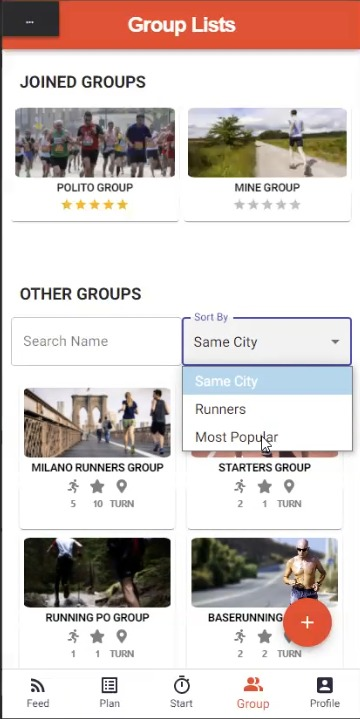
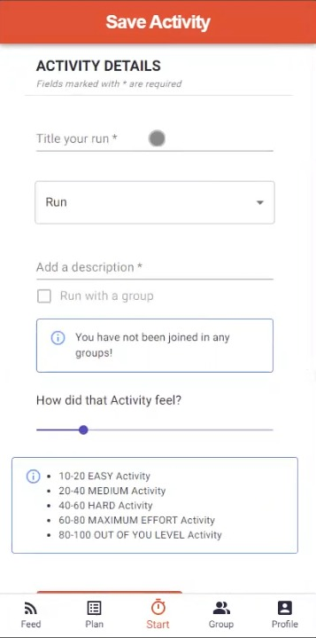

# Milestone 4: Usability Testing - Run Together

## Overview and Script

### Preparation and setup

The usability testing has been done through each pair of team members, one as Facilitator for introducing the application and giving the tasks, and another one as Note-takers take notes of the participant’s behavior, comments, errors and completion of each task.
The application runned on the faciliator's PC and through Zoom the permission for working with the application was given to the participant and the meeting was recording. The notetaker was connected to the meeting and observed everything.

### Participants

- Target population: Amateur Runners
- Age range: 18-70
- Basic skills in using a smartphone
- Expertise with our app: no, never seen it
- Usage of running apps: yes at least once in a month
- Doing running activity: yes at least once in a month
- At least basic knowledge of English

### Equipment

- Computer and webcam (for remote call)
- Internet connection
- Pen and paper (notetakers)

### Artifacts

- [Informed consent form](./docs/InformedConsentForm.pdf)
- Post-Task Questionnaire: Single Ease Question (SEQ)
- [Post-test questionnaire (SUS)](./docs/SUS.pdf)

Recruiting is conducted orally, with a brief list of questions to verify that the potential participant respects the constraints.

### Execution

- **Roles:**  
  One facilitator and one notetakers (all remotely).  
  The full script is available [here.](./docs/Script.md)

- **Methodologies:** Think-aloud for tasks 1 to 5

* **Measures (for each task):**
  - Successful Task Completion
  - Critical Errors
  - Non-Critical Errors
  - Error-Free Rate

- **Measures (for each task):**
  - Successful Task Completion (0-1)

### Tasks

| Task | Task Description                                  | Methodology | Success criteria                                                                                                                 | maximum task time |
| ---- | ------------------------------------------------- | ----------- | -------------------------------------------------------------------------------------------------------------------------------- | ----------------- |
| T1   | Complete one running activity, send your feedback | Think-aloud | Start a Run activity and finish it, finally fill the provided form as feedback and send it.                                      | 10 min            |
| T2   | View the beginner training plan                   | Think-aloud | Select the beginner level and related plan, review the weekly plan and read tips for warming up                                  | 4 min             |
| T3   | Create a running group and add one participant    | Think-aloud | Find the "PLUS" button and fill the provided form (with mandatory fields) and add one participant to the group.                  | 7 min             |
| T4   | Find the most popular running group to join       | Think-aloud | Using the provided "Sort By" and select the most popular group, move to Group details, and click on the JOIN button.             | 7 min             |
| T5   | Check your history of running                     | Think-aloud | After the running activity which is done in T1, check the running activity in the CHART and review the history (Weekly/Monthly). | 5 min             |
| T6   | Leave from one of your joined group               | Think-aloud | Look at the joined group list and select one of them, once the group page opens, click on the remove button.                     | 3 min             |
| T7   | Find the MILANO group; check its information      | Think-aloud | Use the provided search box in Gropu Menu and write the "MILANO" word and check the Group Details on its pages.                  | 5 min             |
| T8   | Check your created group                          | Think-aloud | Make sure that his created group is added into his joined group with correct details (especially the number of runners).         | 3 min             |

### Post-Task Questionnaire: Single Ease Question (SEQ)

After finishing each task the difficuly level of the given task was asked.

1. very difficult 2. 3. 4. 5. 6. 7.very easy

### Post-test oral questions

- In general, how was your experience with our application?
- During the test, **\<something noticed by the notetakers\>**. Can you tell us about it?
- According to your opinion, which are the best and the worst things about this application?
- Do you have any additional comment?

## Run the Tests

The tasks were read by the facilitator to the participant, and repeated when the participant asked them.
During the usability tests, we captured screenshots in the moments were necessary while the meeting was recorded.

''
**\*Task 7**: The user has confusion about the details of the group, why the date,time and location for running is always same \*  
 

''
**\*Task 2**: The user check his running activity, he does not know what is the vertical column of chart is\*  
 

''
**\*Task 4**: The user could not find the search and filtering the groups \*  
 

''
**\*Task 3**: For adding participant, the user could not find any user to add\*  
 

''
**\*Task 7**: The user could not understand the same city filtering\*  
 

''
**\*Task 1**: After running activity for giving the feedback, the user found this page vague at the first glance \*  
 

## Results and List of Changes

After all the heuristic evaluations, we gathered all the data in order to analyze some of the iussues present in the system.

| Task # | # Successful Task Completion | # Critical Errors | # Non-Critical Errors | Error-Free Rate |
| ------ | ---------------------------- | ----------------- | --------------------- | --------------- |
| 1      | 6                            | 0                 | 2                     | 0.75            |
| 2      | 6                            | 0                 | 0                     | 1.0             |
| 3      | 6                            | 0                 | 1                     | 1.0             |
| 4      | 4                            | 2                 | 3                     | 0.5             |
| 5      | 6                            | 0                 | 1                     | 1.0             |
| 6      | 6                            | 0                 | 1                     | 1.0             |
| 7      | 5                            | 1                 | 2                     | 0.75            |
| 8      | 6                            | 0                 | 0                     | 1.0             |

Analyzing the measures computed on the tasks, we discovered that some tasks are more difficult than others to the user.
Tasks with an Error-Free Rate > 0.5 can be consider easy for the user to do. The only most difficult Task was T4 and T7 related to the finding and filtering the groups. 

### SUS Results

| SUS question | User 1 | User 2 | User 3 | User 4 | User 5 | User 6 |
| ------------ | ------ | ------ | ------ | ------ | ------ | ------ |
| 1            | 4      | 4      | 4      | 4      | 4      | 4      |
| 2            | 1      | 2      | 1      | 1      | 1      | 1      |
| 3            | 4      | 5      | 5      | 5      | 5      | 5      |
| 4            | 3      | 4      | 1      | 1      | 2      | 1      |
| 5            | 4      | 4      | 5      | 5      | 3      | 4      |
| 6            | 2      | 1      | 1      | 1      | 2      | 2      |
| 7            | 4      | 5      | 4      | 5      | 5      | 5      |
| 8            | 1      | 1      | 1      | 1      | 2      | 1      |
| 9            | 4      | 4      | 5      | 5      | 5      | 5      |
| 10           | 1      | 1      | 1      | 1      | 1      | 1      |
| **TOTAL**    | 80     | 82.5   | 95     | 97.5   | 85     | 92.5   |

### Post-test considerations

### Test 1 Findings

| Task | Feedback                                                                   |
| ---- | -------------------------------------------------------------------------- |
| T1   | Complete task with confusion, need guidance to reach the starting activity |
| T4   | User does not know the popularity is based on what.                        |
| T6   | After leave group redirect back to the group page                          |

### Test 2 Findings

| Task | Feedback                                                                    |
| ---- | --------------------------------------------------------------------------- |
| T1   | Completed a partial task; first part entirely, some issues in feedback form |
| T4   | Confusing for the icon listed in each group.                                |
| T7   | User does not use search box for searching                                  |

### Test 3 Findings

| Task | Feedback                                                                                                    |
| ---- | ----------------------------------------------------------------------------------------------------------- |
| T1   | Confused about using this part, feedback for after the activity is vague                                    |
| T3   | User does not find the + button for creating group                                                          |
| T4   | Confusing Icons: User does not know what is the popularity is based on, User does not use box for searching |
| T7   | User does not use box for searching                                                                         |

### Test 4 Findings

| Task | Feedback                                                    |
| ---- | ----------------------------------------------------------- |
| T1   | Timer for running should count when switching between pages |
| T5   | The vertical column of activity chart is unclear            |

### Test 5 Findings

| Task | Feedback                           |
| ---- | ---------------------------------- |
| T1   | Some issues for the feedback part  |
| T4   | User could not find the sort box   |
| T7   | User could not find the search box |

### Test 6 Findings

| Task | Feedback                                                            |
| ---- | ------------------------------------------------------------------- |
| T1   | For the first part there were some issues for using map in web mode |
| T4   | Could not find the sort box                                         |

### List of Changes

According the findings, we came to these changes.

| Task | The Finding                                                                                                                     | Potential Change                                                                                                                                                                                                                                                                                  |
| ---- | ------------------------------------------------------------------------------------------------------------------------------- | ------------------------------------------------------------------------------------------------------------------------------------------------------------------------------------------------------------------------------------------------------------------------------------------------- |
| T1   | For most of the users the form after running activity was vague, we redesign this form and put proper space between the fields. |
| T4   | User could not find the search and filter box for searching the groups                                                          | We changed the UI of the group page for seacrging the groups,The search and filter inputs moved to the top of the page and we divided the page to two sections with the border. After that we did another test (4) and we observed user has not any problem for finding the search and filter box |
| T5   | The KM added to the chart                                                                                                       |
