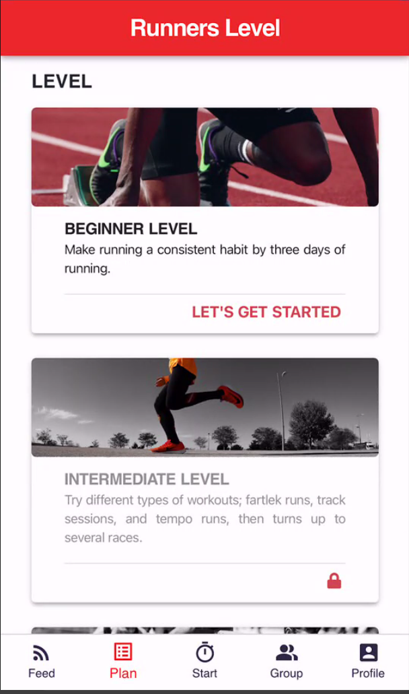
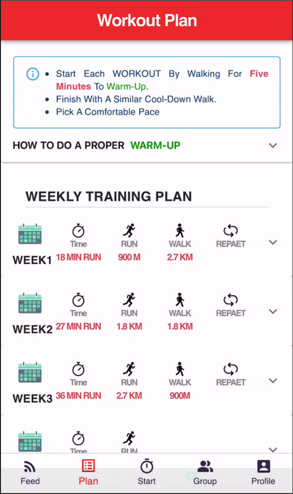

# RunTogether

## Project Idea

We would like to help amateur runners to stay motivated in their training

## Target population

Amateur Runners

## General activity

- the possibility of running with other runners
- the planning of training by exploring the professional OR amateur runners' training plans, issues, tips
- observation of the running progress [distance, pace, duration]

## Screenshots

### Feed Screen:

On this page, the user receives the joined groups activity with details of it.

### Level Screen:

On this screen, users have the chance to select the on option based on its level. At the start, as it is clear, only the beginner level is active.

### Plan Screen:

On this screen, the plans offer users based on their given level, and they can see the details by moving to its page by clicking the "VIEW PLAN" link.

### Plan Details Screen:

The weekly training plan appears on this screen with some tips on top of it.

### Create Group Screen:

Users can create a group and add the participant to their contact lists; the main point is that users would see the added participant, which covers the #6 of Heuristics rules(Recognition rather than recall).

