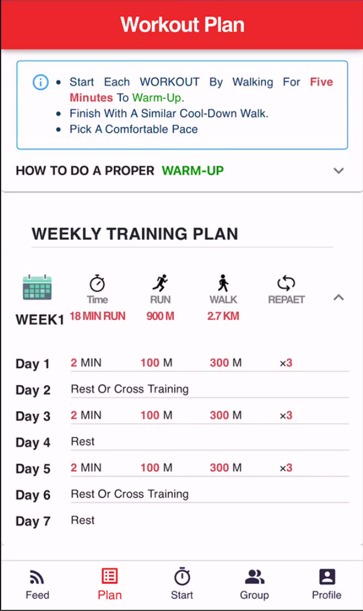
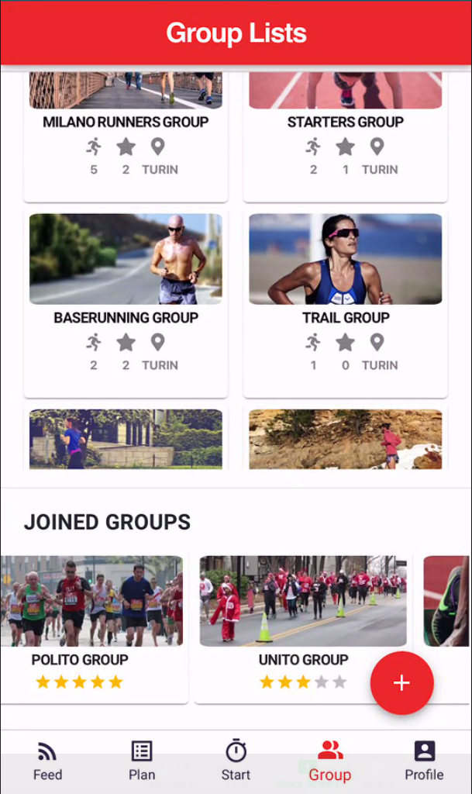
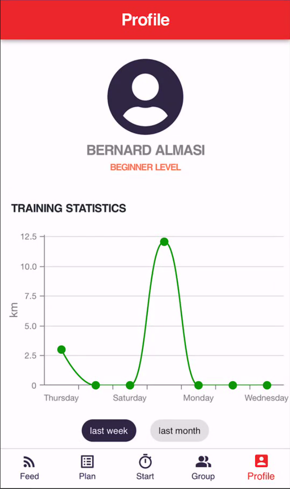

# RunTogether

## Project Idea

We would like to help amateur runners to stay motivated in their training

## Target population

Amateur Runners

## General activity

- the possibility of running with other runners
- the planning of training by exploring the professional OR amateur runners' training plans, issues, tips
- observation of the running progress [distance, pace, duration]

## Screenshots

### Feed Screen:

On this page, the user receives the joined groups activity with details of it.

### Level and Group Screen:

On this screen, users have the chance to select the on option based on its level. At the start, as it is clear, only the beginner level is active.

### Plan Screen:

On this screen, the plans offer users based on their given level, and they can see the details by moving to its page by clicking the "VIEW PLAN" link and the related groups.

### Plan Details Screen:

The weekly training plan appears on this screen with some tips on top of it.

### Run and Activity Screen:

The runners would be able to start running in the Start screen; after finishing this activity, they can fill the provided form to track their progress as a whole.

### Group Lists and Search Screen:

In the Group Lists screen, users would see all available and joined groups separately, concerning finding a suitable group with ease, the "Search Name" and "Sort By" boxes provided.

### Create Group Screen:

Users can create a group and add the participant to their contact lists; the main point is that users would see the added participant, which covers the #6 of Heuristics rules(Recognition rather than recall).

### Profile Screen:

Users can review their weekly and monthly training statistics with the help of provided charts.

